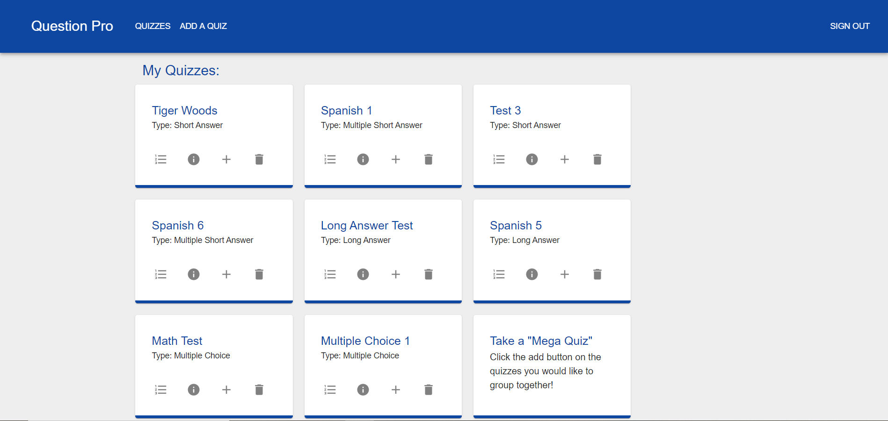
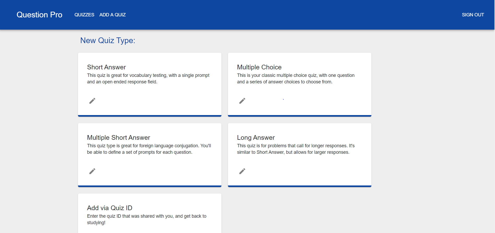
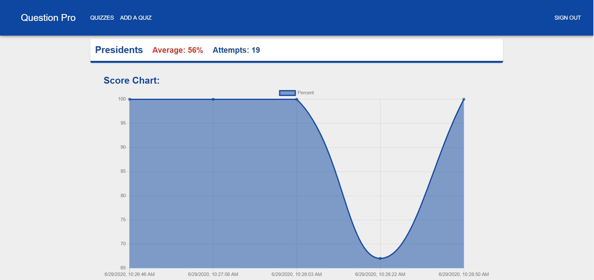
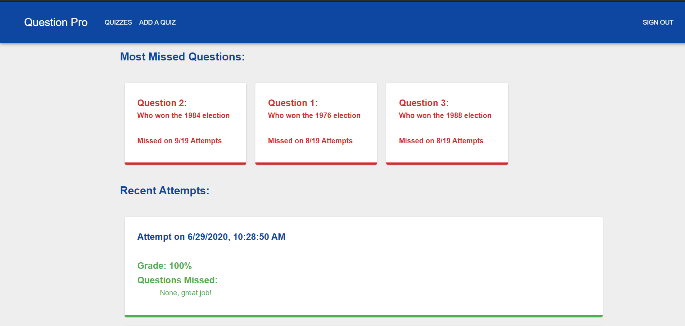
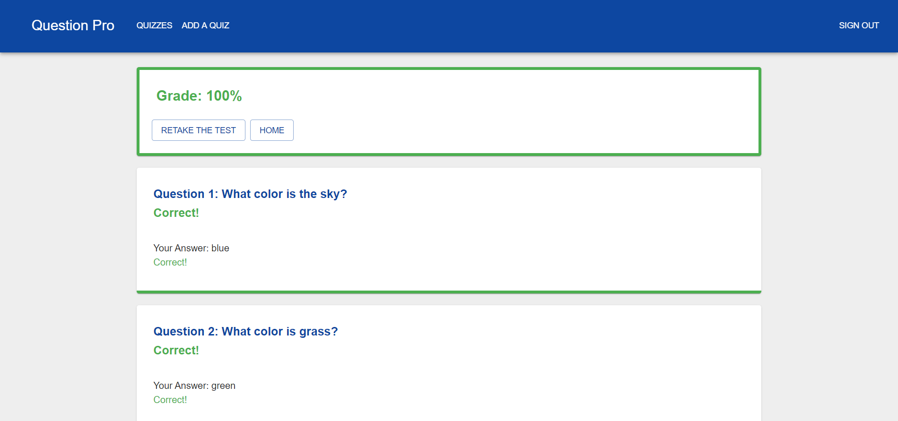
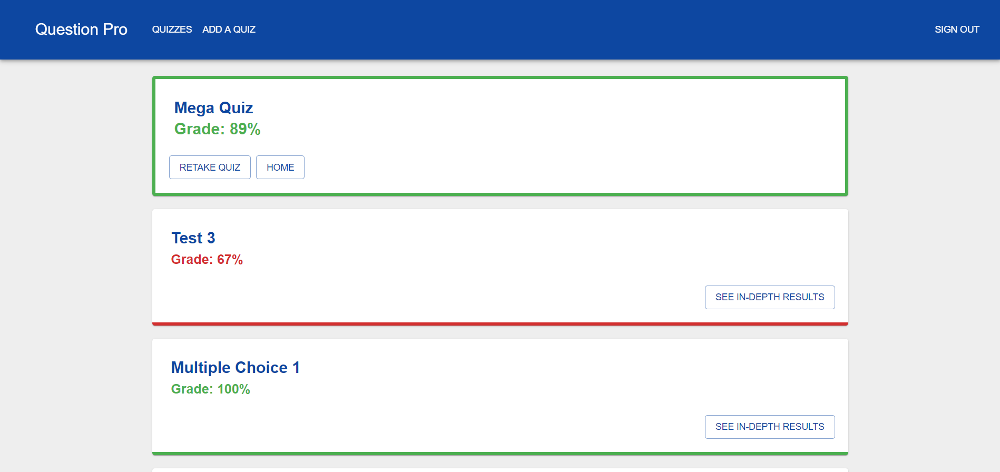

# Question Pro

Welcome to the Question Pro quiz generating study tool. This web application allows you to create quizzes of four different types and keeps track of your progress as you take them. The user can also combine multiple quizzes of different types to take a single "Mega Quiz", and will receive in depth, question by question results for each of the chosen sub-quizzes. 

You can view the site at the link below:

[https://questionpro-65223.firebaseapp.com/](https://questionpro-65223.firebaseapp.com/)

## Demo Images
The following images illustrtate the site's appearance for a user with multiple quizzes and attempts taken.

### Quiz Selection Page

### Add a Quiz Page

### Quiz Statistics Page

### Graded Quiz Page

### Graded Mega-Quiz Page

## Contributors

- [Zizhen Song](https://github.com/HolderOfTime99)
- [Samuel Berensohn](https://github.com/sberen)
